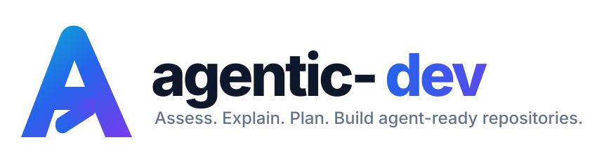

<p align="center">
  
</p>

<p align="center">
  <strong>Vendor-neutral tooling for making repositories agent-ready and preparing safe, reproducible environments for coding agents.</strong>
</p>

<p align="center">
  <a href="https://github.com/szaher/agentic-dev/actions/workflows/ci.yml"></a>
  
  
  
</p>

The goal is simple: make Claude Code, Codex, and similar agents spend less time rediscovering a repository and more time making correct changes with the right local tools.

> **Assess. Explain. Plan. Build agent-ready repositories.**

A strong model is not enough by itself. Good agentic development also needs fast deterministic search, semantic code navigation, dependency awareness, current documentation, reproducible runtimes, isolated Git workflows, and a verification loop. This repo wires those pieces together without forcing one language, framework, or package manager on every project.

## The problem

Out of the box, coding agents often fall back to a costly loop:

```text
grep -> read large file -> grep again -> infer relationships -> edit -> hope
```

That works on small tasks, but it scales poorly. The agent can waste context reconstructing symbol relationships, miss call paths, use stale external APIs, install the wrong runtime, or let multiple agents collide in the same checkout.

`Agentic Dev` creates a local toolchain where each job has a better tool:

```text
exact search          -> rg / fd
structural code       -> ast-grep
symbols/references    -> Serena
call graph / impact   -> CodeGraph
current external docs -> Context7
whole-repo snapshot   -> Repomix
runtime versions      -> mise
Python environments   -> uv
verification          -> compiler / linter / tests
isolation             -> Git worktrees
```

The model still reasons. Deterministic tools retrieve and verify. **Agent Skills** add a fourth layer: reusable engineering workflows that are loaded only when the repo or current task makes them useful.

## What this repo provides

The `agentic` CLI is the public command surface:

- `agentic setup` — run once per workstation. Installs the common foundation, optional language/toolchain support, and can wire supported tools into coding agents.
- `agentic repo init` — run per repository. Detects languages, frameworks, package managers, runtime declarations, build/test commands, code-intelligence prerequisites, and relevant Agent Skills.
- `agentic ready assess|explain|plan` — measure a repository against the [Agent Ready Specification](https://github.com/szaher/agent-ready/tree/main/spec): requirement-based maturity, concrete evidence, and a read-only remediation plan.
- the rest of `agentic` manages skills, capabilities, trust, worktrees, verification, execution, providers, remotes, integrations, and local metrics.

The repository initializer follows this rule:

> Detect -> augment -> never blindly overwrite.

It preserves existing `AGENTS.md`, `CLAUDE.md`, project version files, package-manager conventions, and build wrappers.

## Quick start

### 1. Install Agentic Dev

For normal use, install the Python distribution once a stable release is published:

```bash
uv tool install agentic-dev
agentic --version
```

For prereleases, use:

```bash
uv tool install --prerelease allow agentic-dev
```

Until the first stable PyPI release is published, install from source using the development instructions below.

The wheel includes the workstation/repository bootstrap helpers and policy template, so `agentic setup` and `agentic repo init` work from a PyPI installation.

For development from source:

```bash
git clone https://github.com/szaher/agentic-dev.git
cd agentic-dev
./install.sh
exec "${SHELL:-zsh}"
```

The source installer puts `agentic` and its helper scripts in `~/.local/bin`. Pre-rename helper aliases are retained for one transition release, but new automation should use only:

```bash
agentic setup
agentic repo init
```

Existing user state is migrated non-destructively on first CLI startup. See [`docs/MIGRATION.md`](docs/MIGRATION.md).

After workstation setup, verify the environment:

```bash
agentic doctor
```

Machine-readable form for AgentFlow/automation:

```bash
agentic doctor --json
```

The default text view groups results and shows a **Next** action when attention is needed. This applies to session planning and preparation, repository inspection, verification, skills, capabilities, worktrees, trust, infrastructure status, and the environment check. Use `--json` where offered for the complete structured document; text formatting does not change contract fields or exit codes.

### 2. Bootstrap the Mac once

Recommended for a workstation that already contains multiple repositories:

```bash
agentic setup \
  --scan-root ~/saad/projects \
  --configure-agents
```

A minimal setup is simply:

```bash
agentic setup
```

To preinstall support for selected ecosystems:

```bash
agentic setup --languages python,go,rust,node
```

Or a broader workstation:

```bash
agentic setup --all-languages --configure-agents
```

### 3. Initialize each repository

```bash
cd ~/saad/projects/my-project
agentic repo init .
```

Read-only inspection first:

```bash
agentic repo init . --check
```

Stable machine-readable repository inspection:

```bash
agentic repo inspect . --json
agentic repo inspect . --task "review API compatibility" --json
```

This reports repository facts/evidence, package managers, polyglot build/test/lint/typecheck commands, skills, capabilities, and native agent integrations without modifying the repository.

Project dependency installation is deliberately opt-in:

```bash
agentic repo init . --install-project-deps
```

### 4. Add context-aware Agent Skills

The initializer now recommends a small set of skills after repository discovery:

```bash
agentic repo init .
```

Add task context to improve the recommendation:

```bash
agentic repo init . \
  --task "review the API change for backwards compatibility"
```

Or use the skills CLI directly:

```bash
agentic skills suggest .
agentic skills suggest . --task "debug controller reconciliation failures"
agentic skills list
agentic skills status .
```

The CLI explains *why* a skill matched and lets you accept the recommended set, choose specific entries, select all, or select none. Skills are local/untracked by default; use `--shared` or `--skills-shared` only when the team intentionally wants to commit them.

See [`docs/SKILLS.md`](docs/SKILLS.md).

### 5. Install native agent integrations

The same repo acts as a Claude Code marketplace, Codex marketplace/plugin, and Pi package:

```bash
agentic integrations install all
agentic integrations status
```

You can install individually:

```bash
agentic integrations install claude
agentic integrations install codex
agentic integrations install pi
```

The adapters stay intentionally small. They expose the `agentic` control plane; repo/task-specific engineering skills are still selected on demand rather than permanently loading the whole catalog.

See [`docs/INTEGRATIONS.md`](docs/INTEGRATIONS.md).

### 6. Add optional capabilities only when needed

Browser access is intentionally **not** part of the default install.

Preview capability recommendations:

```bash
agentic capabilities suggest . \
  --task "verify the checkout flow in the browser"
```

Then explicitly enable only the capability you want:

```bash
# Recommended default for UI automation/testing
agentic capabilities enable browser-automation --target both --mode isolated

# Frontend console/network/performance debugging
agentic capabilities enable browser-debug --target both --mode isolated

# Advanced autonomous browser workflows
agentic capabilities enable browser-agent
```

The browser providers are:

- **Playwright MCP** for structured deterministic UI automation;
- **Chrome DevTools MCP** for network, console, tracing, and frontend diagnostics;
- **Browser Use** for broader autonomous browser workflows.

Authenticated/existing-browser access is an explicit mode rather than a default:

```bash
agentic capabilities enable browser-automation \
  --target claude \
  --mode existing-browser
```

See [`docs/CAPABILITIES.md`](docs/CAPABILITIES.md) for the capability model and browser provider details.

### 7. Add security checks under explicit trust profiles

Security scans are optional capabilities:

```bash
agentic capabilities suggest . --task "security review before merge"

agentic capabilities enable secret-scan
agentic capabilities enable dependency-vulnerability
agentic capabilities enable iac-misconfiguration
agentic capabilities enable sbom

agentic capabilities enable sast --profile development
```

Run them with normalized JSON output:

```bash
agentic capabilities run secret-scan . --json
agentic capabilities run dependency-vulnerability . --json
agentic capabilities run sast . --profile development --json
```

Trust profiles make higher-risk modes explicit:

```bash
agentic trust list
agentic trust show safe
agentic trust set development
agentic trust set production-read --repo --path .
```

See [`docs/SECURITY.md`](docs/SECURITY.md) and [`docs/TRUST.md`](docs/TRUST.md).

## Agent configuration

`--configure-agents` configures the tools that can be configured non-interactively and writes a managed tool-routing block into the user-level instruction files when the corresponding agent is installed:

```text
Claude Code: ~/.claude/CLAUDE.md
Codex:       ~/.codex/AGENTS.md
```

Existing content outside the managed block is preserved.

The managed policy tells agents when to use `rg`, `ast-grep`, Serena, CodeGraph, Context7, Repomix, and the verification toolchain. The source template is [`templates/global-agent-policy.md`](templates/global-agent-policy.md).

Context7 setup may require authentication, so it remains explicit:

```bash
npx ctx7 setup --claude
npx ctx7 setup --codex
```

## Agent Ready assessment

Measure how ready a repository is for coding agents against the versioned [Agent Ready Specification](https://github.com/szaher/agent-ready/tree/main/spec):

```bash
agentic ready assess .                          # maturity + every requirement with evidence
agentic ready explain .                         # why the repository has its level
agentic ready explain context.agent_instructions
agentic ready plan . --target optimized         # read-only remediation plan
agentic ready apply . --target structured       # apply safe fixes as managed blocks
agentic ready verify . --target structured      # CI gate on tracked files (exit 0/1/2/3)
agentic ready make . --target structured        # safe fixes until met; stops on human decisions
```

```text
Maturity: Foundational (level 1 of 4)
Target:   Structured — not met

Levels
  ✓ 0 Unaware
  ✓ 1 Foundational   5 required, 4 pass, 1 n/a
  ✗ 2 Structured     11 required, 7 pass, 3 fail, 1 n/a
      blocking: constraints.documented, context.agent_instructions, context.agent_instructions.commands
  ✗ 3 Optimized      3 required, 1 fail, 1 unknown, 1 n/a
      blocking: constraints.architecture_boundaries, context.task_workflows
  ✗ 4 Autonomous     5 required, 4 fail, 1 unknown
```

Maturity is requirement-based, not a score. A level is reached only when all of its required rules, and those of every lower level, pass. `pass`, `fail`, `unknown` (team policy that cannot be inferred), and `not-applicable` are distinct. Assessment is deterministic, offline, uses no LLM, and never modifies the repository. The spec is pinned into the package by version and sha256.

See [`docs/READINESS.md`](docs/READINESS.md).

## Smart repository detection

The repo initializer recognizes common project signals for:

- Python
- Go
- Rust
- Node.js / TypeScript / JavaScript
- Deno
- Java and Kotlin
- C / C++
- Ruby
- PHP
- Swift
- Terraform
- Bash / Shell
- Lua
- Zig
- Angular, Svelte, and Vue
- Docker/Podman usage
- Helm and Kustomize
- Protobuf/Buf
- Bazel
- GitHub Actions
- Ansible

It also detects package-manager and runtime conventions such as:

```text
uv.lock              pyproject.toml       poetry.lock
pnpm-lock.yaml       yarn.lock            package-lock.json
Cargo.toml           go.mod               Gemfile
composer.json        pom.xml              gradlew / mvnw
.mise.toml           .tool-versions       .python-version
.node-version        .nvmrc
```

For polyglot repositories, Serena is configured with the detected language set rather than treating the project as a single-language codebase.

Skill detection uses repository facts plus optional task text. It can recommend language, technology/repository-type, and workflow skills such as Python/Go/Rust/TypeScript engineering, Kubernetes operator development, API design, migrations, testing, debugging, review, refactoring, performance analysis, CI, containers, and Terraform. It does not automatically activate every match.

## Safety defaults

The scripts are intentionally conservative.

- They are designed to be rerunnable.
- Existing `AGENTS.md` and `CLAUDE.md` files are not overwritten.
- Local generated intelligence state is added to `.git/info/exclude`, not the tracked `.gitignore`.
- Project dependencies are not installed unless `--install-project-deps` is passed.
- Container runtimes are detected but Docker Desktop/Podman Desktop are not auto-installed.
- Repository-declared versions are respected where possible instead of replacing them with global defaults.
- `--check` performs repository discovery without modifying the repo or installing support.

Useful switches:

```bash
agentic repo init . --no-codegraph
agentic repo init . --no-serena
agentic repo init . --no-instructions
agentic repo init . --no-install-language-deps
agentic repo init . --no-runtime-install
```

## Why these tools

The core tools are intentionally complementary rather than redundant.

| Tool | Role in agentic development |
|---|---|
| [ripgrep](https://github.com/BurntSushi/ripgrep) | Fast exact-text search. Better than spending semantic-tool calls on a literal lookup. |
| [fd](https://github.com/sharkdp/fd) | Fast file discovery with sane defaults. |
| [ast-grep](https://ast-grep.github.io/) | AST-aware structural search and repeatable source transformations. |
| [Serena](https://github.com/oraios/serena) | Symbol-level semantic navigation, references, implementations, diagnostics, and refactoring through MCP. |
| [CodeGraph](https://github.com/colbymchenry/codegraph) | Local pre-indexed graph for call paths, dependency relationships, architecture exploration, and impact analysis. |
| [Context7](https://github.com/upstash/context7) | Current, version-aware external library/API documentation for agents. |
| [Repomix](https://github.com/yamadashy/repomix) | Compact repository snapshots when whole-repo or cross-repo context is useful. |
| [mise](https://mise.jdx.dev/) | Reproducible runtime/tool version management across projects. |
| [uv](https://docs.astral.sh/uv/) | Fast Python environments, packages, and tool execution. |
| [direnv](https://direnv.net/) | Per-directory environment activation. |
| [just](https://github.com/casey/just) | Small, explicit task runner that gives humans and agents stable commands. |
| [GitHub CLI](https://cli.github.com/) | Repository, PR, issue, release, and CI workflows from the terminal. |
| [delta](https://github.com/dandavison/delta) | More readable diffs for humans and agent-assisted review. |

The full catalog, including language servers and auxiliary tools installed on demand, is in [`docs/TOOLS.md`](docs/TOOLS.md).

## Worktrees for concurrent agents

Do not run several write-capable agents in the same working tree. Use the built-in manager:

```bash
agentic worktree create feature-a \
  --agent codex \
  --task "implement feature A"

agentic worktree list
agentic worktree status feature-a
agentic worktree clean feature-a --delete-branch
```

Dirty worktrees are refused unless `--force` is explicit. Agent/task metadata is stored locally and is not added to repository changes.

See [`docs/WORKTREES.md`](docs/WORKTREES.md).

## Change-aware verification

Plan the smallest relevant verification set from the current diff:

```bash
agentic verify
agentic verify --json
agentic verify plan --base main --symbol TrainingReconciler --json
```

Run the selected checks:

```bash
agentic verify run
agentic verify run --continue-on-failure --json
```

When available, CodeGraph contributes affected-test and symbol-impact evidence. Enabled security capabilities are folded into the plan when relevant.

See [`docs/VERIFICATION.md`](docs/VERIFICATION.md).

## Execution backends

The default remains direct host execution, but verification can run through isolated environments:

```bash
agentic execution status

agentic execution configure container \
  --image python:3.13 \
  --network none \
  --repo

agentic verify run \
  --backend container \
  --image python:3.13 \
  --profile development \
  --json
```

Supported backends are host, Docker/Podman containers, Dev Containers, and Dagger Workspace execution.

See [`docs/EXECUTION.md`](docs/EXECUTION.md).

## Infrastructure capability packs

Database, Kubernetes/OpenShift, cloud, and observability access are opt-in and trust-gated:

```bash
agentic infra status --json

agentic capabilities enable database-read --profile development
agentic infra database schema sqlite --sqlite-file ./app.db --profile development --json

agentic capabilities enable cluster-read --profile production-read
agentic infra cluster run --profile production-read get pods

agentic capabilities enable cloud-read --profile production-read
agentic infra cloud identity aws --profile production-read --json

agentic capabilities enable observability-read --profile production-read
agentic infra observability status --profile production-read --json
```

Cluster/cloud write require custom profiles with explicit `cluster.write` or `cloud.write`; no built-in profile grants them.

See [`docs/INFRASTRUCTURE.md`](docs/INFRASTRUCTURE.md).

## Repository layout

```text
agentic-dev/
├── install.sh
├── pyproject.toml
├── src/agentic_dev/
│   ├── cli.py
│   ├── capabilities.py
│   ├── detect.py
│   ├── skills.py
│   ├── readiness/          # Agent Ready assessment + pinned spec bundle
│   └── builtin_skills/
├── integrations/
│   ├── claude/
│   ├── codex/
│   └── pi/
├── scripts/
│   ├── agentic-setup.sh
│   ├── agentic-setup-linux.sh
│   └── agentic-repo-init.sh
├── templates/
│   └── global-agent-policy.md
├── docs/
│   ├── ARCHITECTURE.md
│   ├── AGENT_CONFIGURATION.md
│   ├── API.md
│   ├── CAPABILITIES.md
│   ├── INTEGRATIONS.md
│   ├── READINESS.md
│   ├── SECURITY.md
│   ├── SKILLS.md
│   ├── TRUST.md
│   └── TOOLS.md
├── tests/
│   └── smoke.sh
└── .github/workflows/
    └── ci.yml
```

## Design notes

See [`docs/ARCHITECTURE.md`](docs/ARCHITECTURE.md) for the problem model, architecture, and why machine setup and repository setup are separate concerns.

See [`docs/API.md`](docs/API.md) for the stable JSON contracts intended for AgentFlow, CI, plugins, and other automation.

See [`docs/AGENT_CONFIGURATION.md`](docs/AGENT_CONFIGURATION.md) for global instruction hierarchy and MCP/tool setup.

See [`docs/INTEGRATIONS.md`](docs/INTEGRATIONS.md) for Claude Code plugins, Codex plugins/marketplaces, and the Pi package.

See [`docs/CAPABILITIES.md`](docs/CAPABILITIES.md) for optional capability packs.
See [`docs/SECURITY.md`](docs/SECURITY.md) for local security scanning.
See [`docs/TRUST.md`](docs/TRUST.md) for trust and permission profiles.

See [`docs/ROADMAP.md`](docs/ROADMAP.md) for Roadmap v2, which takes the project from the current v0.13 capability control plane toward a stable v1.0 agentic development platform. The completed v0.5–v0.13 roadmap is archived at [`docs/roadmaps/ROADMAP-v0.5-v0.13.md`](docs/roadmaps/ROADMAP-v0.5-v0.13.md).

## Development

Run the local checks:

```bash
make check
```

The CI workflow performs syntax checks and a read-only repository smoke test on macOS.

## License

MIT. See [`LICENSE`](LICENSE).


## External providers

Extend the environment without patching core:

```bash
agentic providers add ./my-provider
agentic providers list
agentic providers verify my-provider
agentic providers doctor --json

# explicit updates only
agentic providers update my-provider --yes
agentic update --yes
```

Providers can contribute Agent Skills and trust-gated command capabilities through the versioned `agentic-provider.json` protocol. Git providers record their resolved commit SHA and can require a Git-verified signed commit. Installed content is SHA-256 checked before it is loaded.

See [`docs/PROVIDERS.md`](docs/PROVIDERS.md).

## Linux / WSL and remote development

The workstation bootstrap now dispatches natively on macOS or Linux/WSL:

```bash
agentic setup --configure-agents
```

SSH development profiles describe remote machines without storing passwords or private-key contents:

```bash
agentic remote add gpu-lab gpu.example.com \
  --user saad \
  --identity-file ~/.ssh/id_ed25519 \
  --workdir /srv/project

agentic remote test gpu-lab --json
```

See [`docs/REMOTE.md`](docs/REMOTE.md).


## Local measurement and evaluation

Metrics are **off by default** and remain local:

```bash
agentic metrics status
agentic metrics enable

agentic metrics summary --since 7d --json
```

The built-in instrumentation measures execution failures/durations, verification duration and first passing test timing, change size, worktree sessions, recommendation uptake, capability outcomes, and CodeGraph use. AgentFlow or native agent integrations can add local structured events such as:

```bash
agentic metrics record agentflow.stage \
  --session-id run-123 \
  --field stage=review \
  --field outcome=passed

agentic metrics record context.used \
  --session-id run-123 \
  --field source=serena \
  --field useful=true
```

Export is explicit and file-only:

```bash
agentic metrics export --output ./agentic-metrics.jsonl --since 7d
```

There is no network telemetry/export path.

See [`docs/METRICS.md`](docs/METRICS.md).


## Roadmap v2

The active roadmap is centered on four outcomes:

1. **Make repositories agent-ready** using the Agent Ready maturity model as a versioned specification, with assessment, remediation, and CI regression checks.
2. **Make agent configurations portable** through first-class Skill, Agent, AgentTeam, MCPServer, Plugin, Pack, WorkflowRef, and EnvironmentProfile artifacts plus local/federated catalogs.
3. **Make task sessions minimal and reproducible** with lockfiles, content-addressed storage, context budgeting, trust/policy, credentials, and unified execution backends.
4. **Make the stack governable and measurable** through deep AgentFlow integration, organization policy, evaluation, and optional telemetry.

The product boundary is deliberate:

```text
agent-ready     -> defines the readiness standard
agentic-dev     -> assesses and prepares the environment
AgentFlow       -> governs and orchestrates development workflows
```

See the full [Roadmap v2](docs/ROADMAP.md).


## Brand assets

The canonical logo, mark, README banner, palette, and usage rules live in [`assets/brand/`](assets/brand/) and [`docs/BRAND.md`](docs/BRAND.md).
